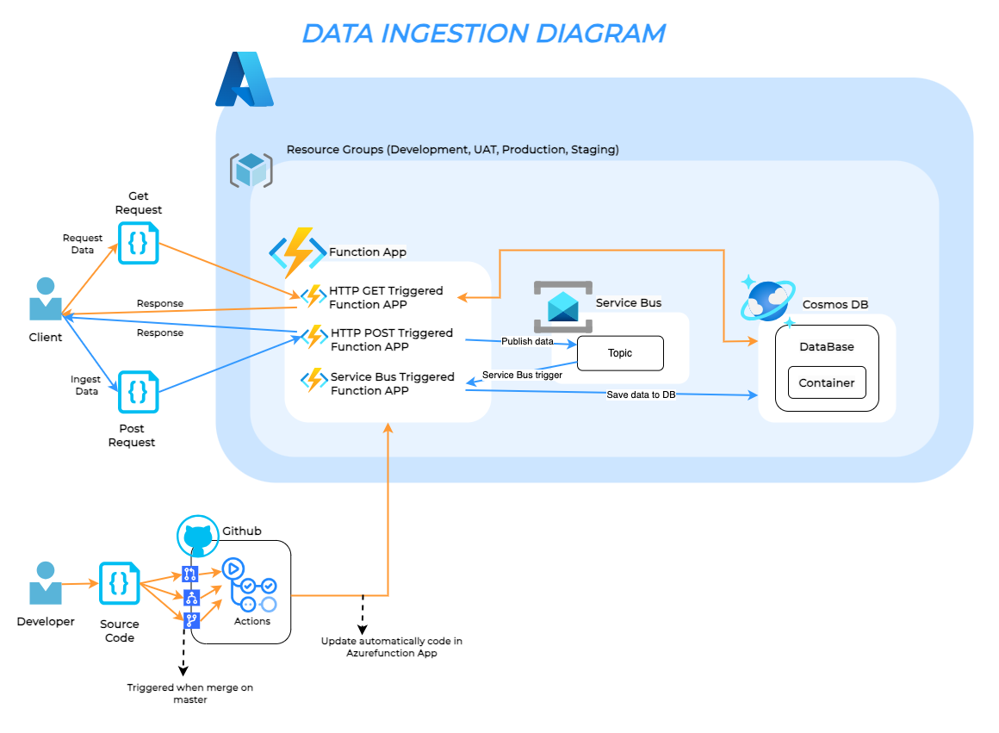

# data-ingestion-api
This repository contains a proof of concept (PoC) for a cloud-based system that ingests, stores, and exposes data via an HTTP API. It uses serverless Azure services (Functions, Service Bus, and Cosmos DB) and is deployed with Terraform and a CI/CD pipeline via GitHub Actions.

## Parte 1: Infraestructura e IaC

### 1.1 Esquema de Infraestructura

Se eligió un enfoque serverless para el sistema con los siguientes componentes:

- **Azure Functions**: Para la ingesta de datos y exposición de la API.
- **Azure Service Bus**: Utilizado como intermediario de mensajes (Pub/Sub) para desacoplar la ingesta de datos del almacenamiento.
- **Azure Cosmos DB**: Base de datos distribuida y escalable para almacenar los datos recibidos.
  
El sistema completo está basado en una arquitectura de Pub/Sub. Los datos se reciben a través de una API HTTP y se publican en un **Azure Service Bus Topic**. Una **Azure Function** con un **Service Bus Trigger** se activa y procesa los mensajes, guardando los datos en **Cosmos DB**.

### 1.2 Implementación con Terraform

Se proporcionó un archivo de **Terraform** que permite desplegar la infraestructura mencionada automáticamente. Los recursos creados son:

- Un **Resource Group**.
- Un **Service Bus Namespace** con un **Topic** y **Subscription**.
- Una **Azure Function App**.
- Una **Azure Cosmos DB**.
- Una **Storage Account** para almacenar archivos necesarios por las funciones.

## Parte 2: Aplicaciones y Flujo CI/CD

### 2.1 API HTTP

Se implementó un endpoint HTTP en **Azure Functions** que expone los datos almacenados en **Cosmos DB** a través de un método GET. Este endpoint recibe un `userId` como parámetro y devuelve los datos correspondientes.

### 2.2 CI/CD con GitHub Actions

El despliegue de la API HTTP y las Azure Functions están completamente automatizados mediante **GitHub Actions**. El pipeline realiza las siguientes tareas:

1. **Build**: Valida y construye la aplicación. También ejecuta un **linter** (en este caso, **ruff**) para asegurar que el código sigue las buenas prácticas.
2. **Deploy**: Utilizando el perfil de publicación de Azure, despliega la API y las funciones en la nube.
3. **Tests de Integración**: Se ejecutan pruebas que verifican que la API está exponiendo correctamente los datos de la base de datos, asegurando que el sistema funcione de extremo a extremo.

Los pasos de CI/CD están divididos en dos workflows: uno para el build y otro para los tests de integración. 

### 2.3 Ingesta
La ingesta de datos en esta solución utiliza un esquema **Pub/Sub** con **Azure Service Bus** como el sistema de mensajería para recibir y almacenar datos en una base de datos Cosmos DB. A continuación, se explica el flujo detallado de cómo funciona la ingesta de datos:

1. Publicación de Datos (Endpoint HTTP - POST)
- El cliente o sistema externo envía los datos a través de un **HTTP POST** hacia el endpoint de Azure Functions, que recibe y valida los datos.
- Estos datos se validan usando el modelo `UserSchema`, que asegura que la estructura de los datos sea correcta antes de procesarlos.
- Si los datos son válidos, la función HTTP envía estos datos como un **mensaje** al **Service Bus**. Esto se hace usando el `ServiceBusService`, que implementa la lógica para enviar mensajes al tópico de Service Bus.
2. Azure Service Bus (Pub/Sub)
- El **Service Bus** actúa como intermediario en el flujo de ingesta, recibiendo los mensajes (datos de usuarios) en un **tópico**. Este es el componente **"publish"** del sistema.
- El Service Bus tiene configurada una **suscripción** que escucha los mensajes del tópico. La suscripción está conectada a una **Azure Function** que tiene como **trigger** el Service Bus. Este es el componente **"subscribe"** del sistema.

3. Procesamiento de Mensajes (Service Bus Trigger - Azure Function)
- Una **Azure Function** se activa cada vez que llega un mensaje al Service Bus. Esta función está diseñada para consumir (suscribirse) los mensajes desde el tópico de Service Bus.
- La función extrae los datos del mensaje (que en este caso es información del usuario) y los envía al servicio de persistencia `CosmosDBService`.

4. Almacenamiento en Cosmos DB
- La función Azure con el **Service Bus Trigger** procesa el mensaje y luego guarda estos datos en una **base de datos Cosmos DB** utilizando el `CosmosDBService`.
- En este punto, los datos son almacenados en un contenedor de Cosmos DB, con una estructura JSON definida por el modelo de datos `UserSchema`. Si el mensaje no contiene un `id`, se le asigna automáticamente un `UUID` para asegurar que cada registro en la base de datos es único.

### 2.4 Diagrama
### Diagrama de Arquitectura

## Parte 3: Pruebas de Integración y Puntos Críticos de Calidad

### 3.1 Pruebas de Integración

Se implementaron pruebas de integración que validan lo siguiente:

- **GET de Datos de Usuario**: Verifica que la API expone correctamente los datos almacenados en **Cosmos DB**.
- **GET de Usuario No Existente**: Asegura que la API retorna un código 404 cuando se solicita un `userId` no presente en la base de datos.

Estas pruebas se ejecutan al final del pipeline de CI/CD para validar el estado de la API tras el despliegue.

### 3.2 Otras Pruebas de Integración Propuestas

Se pueden añadir pruebas para validar que la ingesta de datos a través del **Service Bus** funciona correctamente, asegurando que los mensajes se están procesando y almacenando sin errores.
#### Prueba 1: Verificación de la ingesta de datos a través del Service Bus

**Descripción**: Esta prueba verificará que, al enviar un mensaje al Service Bus, dicho mensaje es correctamente procesado por la Azure Function y almacenado en la base de datos CosmosDB.

**Pasos para implementar**:
1. **Mockear el Service Bus**: Crear un mock o utilizar un entorno de pruebas para enviar mensajes al Service Bus desde la prueba.
2. **Enviar un mensaje al tópico del Service Bus**:
    - Simular el envío de un mensaje con un payload similar al que sería utilizado en producción (por ejemplo, un objeto JSON que represente los datos de un usuario).
3. **Esperar la ejecución de la Azure Function**: Las Azure Functions deben procesar el mensaje de forma asíncrona, por lo que la prueba debe esperar un tiempo prudente o implementar un mecanismo para saber cuándo ha sido procesado el mensaje.
4. **Verificar en CosmosDB**:
    - Tras el procesamiento, realizar una petición directa a la base de datos (o utilizar el API HTTP) para validar que el mensaje fue almacenado correctamente.
    - Comprobar que los datos almacenados en CosmosDB coinciden con el payload enviado en el mensaje.

### 3.3 Puntos Críticos del Sistema

Algunos puntos críticos del sistema podrían ser:

- **Retrasos en la entrega de mensajes en el Service Bus**: Dado que el sistema utiliza un esquema Pub/Sub para la ingesta de datos, es importante asegurar que los mensajes se entregan y procesan en un tiempo razonable. Para medir este punto, se puede calcular el tiempo de latencia entre que un mensaje es publicado en el Service Bus y el momento en que es procesado por la Azure Function. Se puede implementar un log que registre la diferencia entre el `EnqueuedTimeUtc` del mensaje y el tiempo real de procesamiento en la función.

  **Forma de testeo**:
  - Crear un test de integración que envíe mensajes al Service Bus y calcule el tiempo que toma desde la publicación hasta el procesamiento.
  - Establecer umbrales de tiempo aceptable (por ejemplo, <2 segundos) y lanzar alertas si se exceden esos tiempos.

- **Sobrecarga de la base de datos CosmosDB**: La base de datos puede experimentar problemas de rendimiento si se alcanzan los límites de las RUs o si las consultas no están optimizadas. Esto podría derivar en tiempos de respuesta lentos o errores de tiempo de espera.

  **Forma de testeo**:
  - Implementar un monitoreo del uso de RUs en CosmosDB y medir la cantidad de RUs consumidas por cada consulta.
  - Simular cargas de datos más grandes o realizar pruebas de estrés sobre la base de datos para medir su comportamiento bajo carga.
  - Realizar consultas de prueba y medir el tiempo de respuesta promedio.

- **Disponibilidad y latencia de la API HTTP**: La API debe ser capaz de servir solicitudes GET de manera rápida y eficiente. Si la API sufre problemas de latencia o tiempo de inactividad, esto impactaría la experiencia del cliente.

  **Forma de testeo**:
  - Realizar pruebas de carga a la API HTTP para evaluar su rendimiento bajo diferentes niveles de tráfico.
  - Medir el tiempo de respuesta promedio (latencia) y la tasa de errores de las solicitudes.
  - Realizar pruebas de disponibilidad y configurar alertas si la tasa de éxito cae por debajo de un umbral definido.
  
### 3.4 Propuestas de Mejoras

Para robustecer el sistema y solucionar los puntos críticos mencionados anteriormente, se pueden tomar las siguientes medidas:

- **Optimización de la latencia del Service Bus**:
  - **Escalado horizontal de las Azure Functions**: Utilizar la capacidad de escalado automático de Azure Functions en el plan de consumo para procesar más mensajes simultáneamente cuando se observe un aumento en la cola del Service Bus.
  - **Implementar políticas de reintento**: Configurar reintentos automáticos en caso de fallos en el procesamiento de mensajes.
- **Mejora del rendimiento de CosmosDB**:
  - **Optimización de consultas y particionamiento**: Revisar las consultas a CosmosDB para asegurarse de que estén optimizadas.
  - **Aumentar las RUs de la base de datos**: Configurar el escalado automático de las RUs en CosmosDB, lo que permite que la base de datos incremente sus capacidades en función de la demanda, manteniendo el rendimiento sin tiempos de inactividad o errores de límite de recursos.

- **Mejorar la disponibilidad y latencia de la API HTTP**:
  - **Distribución geográfica**: Implementar un modelo de replicación geográfica para la API y CosmosDB, permitiendo que los usuarios accedan a la API desde la región más cercana, reduciendo así la latencia.
  - **Caché de respuestas**: Configurar un servicio de caching como Azure Redis Cache para almacenar respuestas a las solicitudes GET frecuentes, reduciendo la carga en la API y acelerando las respuestas a los usuarios.

- **Monitoreo proactivo y alertas**:
  - **Métricas de desempeño**: Implementar un monitoreo avanzado que mida el uso de RUs en CosmosDB, la latencia del Service Bus, y el tiempo de respuesta de la API HTTP. Estas métricas pueden ser utilizadas para activar alertas y escalar recursos antes de que los problemas afecten a los usuarios finales.
  - **Pruebas de carga regulares**: Realizar pruebas de estrés periódicas a la API y la base de datos para identificar cuellos de botella y ajustar la infraestructura antes de eventos de alta carga.
  
## Parte 4: Métricas y Monitoreo

### 4.1 Métricas Propuestas

- **Tiempo de Procesamiento de Mensajes**: Cuánto tiempo tarda la función en procesar un mensaje desde que llega al **Service Bus**.
- **Número de Mensajes en Cola**: Indica cuántos mensajes están pendientes de ser procesados.
- **Tasa de Errores de Funciones**: Cuántas ejecuciones de funciones fallan y no procesan el mensaje correctamente.

### 4.2 Herramienta de Visualización

Se propone el uso de **Azure Monitor** junto con **Azure Application Insights** para recolectar y visualizar métricas en tiempo real. Azure Monitor permite configurar paneles donde se pueden observar todas las métricas mencionadas.

Otra opción podria ser el uso del **Log Analytics Workspace** y usando **workbooks**, creamos una interfaz gráfica con las metricas a monitorear usando queries con KQL para filtrar la información.

### 4.3 Implementación

Las métricas serían recolectadas automáticamente mediante **Application Insights** y almacenadas en **Azure Monitor**, donde se pueden crear alertas personalizadas para detectar problemas de performance o errores en el sistema.

### 4.4 Escalabilidad a 50 Sistemas Similares

Con una mayor escala, sería importante monitorear métricas adicionales como el uso de conexiones de red y capacidad de procesamiento del **Service Bus** para asegurar que el sistema sigue funcionando eficientemente.

### 4.5 Limitaciones

Un mal diseño de los mecanismos de monitoreo y alertas podría resultar en falta de visibilidad sobre problemas críticos, lo que afectaría la escalabilidad y la resiliencia del sistema.

## Parte 5: Alertas y SRE

### 5.1 Reglas de Alertas

- **Tasa de Errores**: Alertar si la tasa de errores en las funciones supera el 1% en los últimos 10 minutos.
- **Tiempo de Procesamiento**: Alertar si el tiempo de procesamiento de mensajes del **Service Bus** supera los 5 segundos.

### 5.2 SLIs y SLOs

- **SLI de Disponibilidad**: El sistema debe estar disponible el 99.9% del tiempo.
- **SLI de Tasa de Éxito de Mensajes**: El 99.9% de los mensajes recibidos en el **Service Bus** deben ser procesados exitosamente.
  
### 5.3 Argumentación

Elegí estos SLIs y SLOs porque están alineados con la necesidad de asegurar que el sistema procese mensajes de manera confiable y eficiente, mientras minimizamos el impacto en el usuario final.